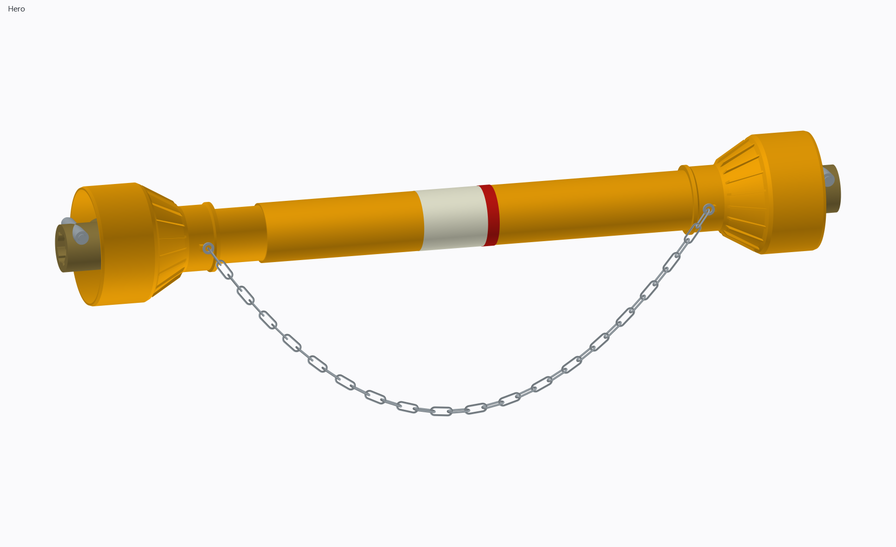
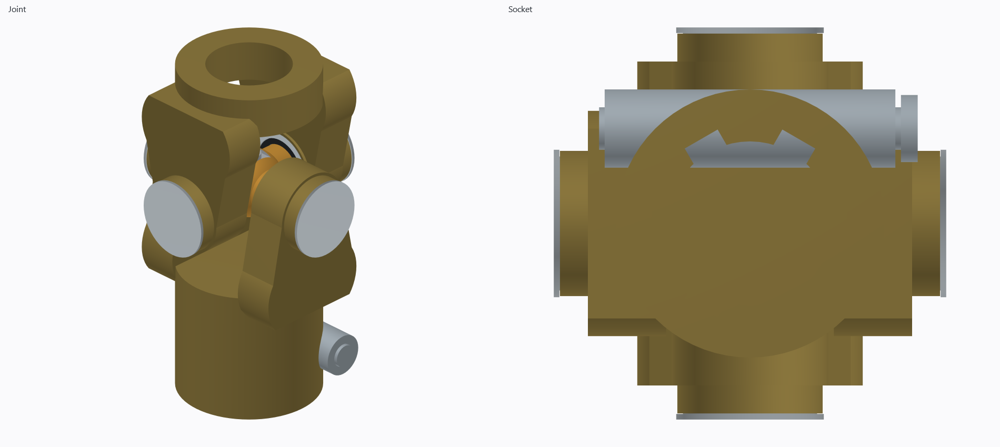

# DEMA 67991 PTO shaft reconstruction

This example reconstructs the DEMA 67991 tractor PTO shaft from product photos
and published dimensions. Separate part builders use sketch arcs, extrusions,
revolved guard sections, booleans, and swept round-wire chain links. Native
assembly constraints locate the yokes, crosses, bearing cartridges, telescoping
profiles, and the collapsed/extended positions.

The normal view shows full guards and both female six-spline sockets. Each bell
is a thin hollow part with an open mouth, tapered ribbed shoulder, neck, and
chain lug. The two rounded-triangle steel tubes telescope inside overlapping
plastic sleeves. Each cross has four bearing cartridges with cups, 24 needle
rollers, seals, and a grease fitting.

Run from the repository root with the installed Camber wheel:

```powershell
.\.venv\Scripts\python.exe Geo.Python\python\examples\pto_shaft\assembly.py
.\.venv\Scripts\python.exe Geo.Python\python\examples\pto_shaft\assembly.py --extended
.\.venv\Scripts\python.exe Geo.Python\python\examples\pto_shaft\assembly.py --cutaway
.\.venv\Scripts\python.exe Geo.Python\python\examples\pto_shaft\assembly.py --detail
.\.venv\Scripts\python.exe Geo.Python\python\examples\pto_shaft\assembly.py --obj --no-show
```

The script writes `pto_shaft_showcase.png` and `pto_joint_detail.png` beside
itself and opens Camber's existing viewer. `--no-show` renders without opening
a window; `--no-render` skips image capture.
`--obj` writes one Wavefront OBJ with a separate named object for every
assembled part occurrence, including the bearing cartridge internals.

Published DEMA 67991 dimensions are 800–1100 mm overall length, 120 mm guard
bell diameter, 1⅜-inch six-spline connections at both ends, and a triangular
telescoping drive profile. The product is rated at 210 Nm for 540 rpm PTO use.
Source: [DEMA 67991 listing](https://www.stabilo-fachmarkt.de/gelenkwelle-zapfwelle-85-110-cm-standard-1-3-8-zoll-6-zaehne_818_1657/).

The photos establish appearance but do not dimension the forged yokes, spline
root and flank geometry, spring button, cross journals, needle cups, tube wall,
plastic guard wall, or working clearances. Those dimensions in `assumptions.py`
and `parts.py` are inferred and editable. The model is an assembly and modeling
example; it has not been validated as a manufacturing drawing for a DEMA part.



